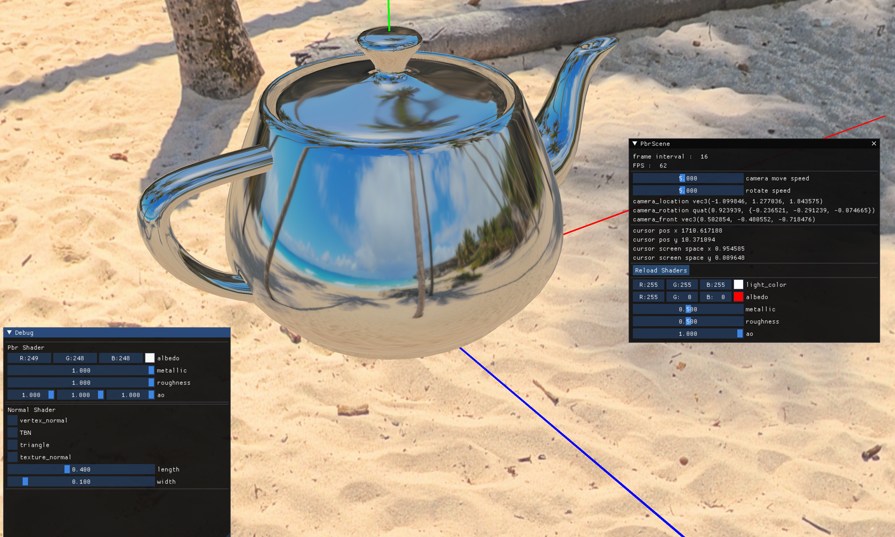
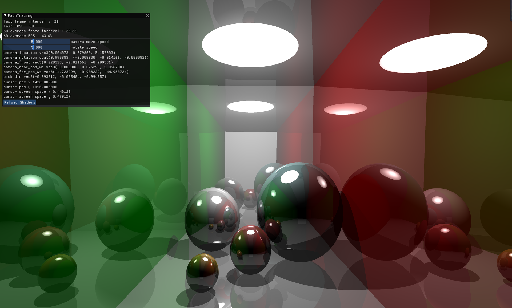
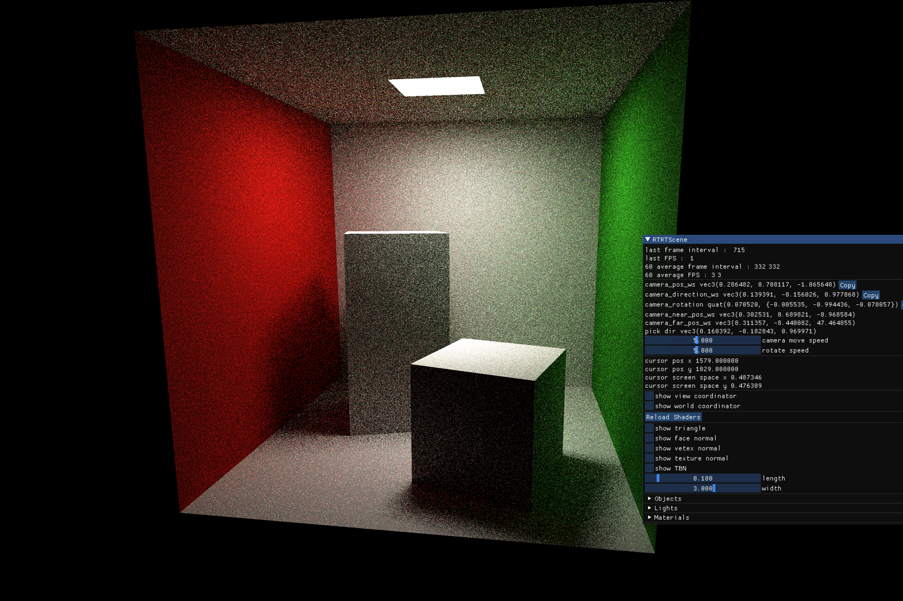
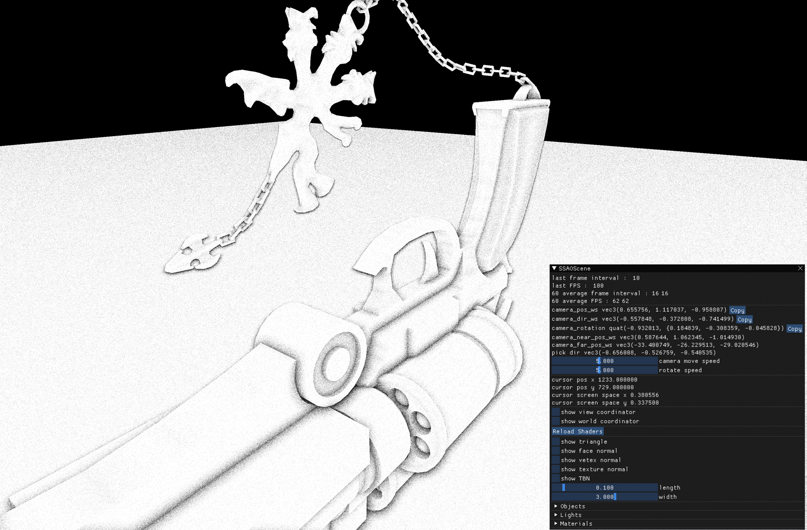

### Target
Learn to build faster && more realistic && more lightweight renderer

### SplitSum


### RayTracingDemo


### PathTracingDemo


### PathTracing


### SSAO (1ms, 62fps)


## Build

```bash
git submodule update --init --recursive
cmake --preset dev
cmake --build --preset dev
./build/dev/bin/window
```

The helper scripts do the same thing:

```bash
./run
./run.sh
./test.sh
```

Runtime selection:

```bash
./run
CG_RUNTIME=opengl ./run
CG_RUNTIME=vulkan ./run
CG_RUNTIME=opengl CG_GL_RUNTIME=native ./run
CG_RUNTIME=opengl CG_GL_RUNTIME=mesa ./run    # llvmpipe scene renderer via Mesa offscreen (EGL or OSMesa)
CG_RUNTIME=vulkan CG_GL_RUNTIME=mesa ./run    # Vulkan presentation + llvmpipe scene renderer via Mesa offscreen

# If CMake does not auto-detect Mesa, point it at your install root before configuring:
cmake --preset dev -DCG_OSMESA_ROOT=/path/to/mesa/prefix
CG_WINDOW_WIDTH=1280 CG_WINDOW_HEIGHT=720 ./run
```
